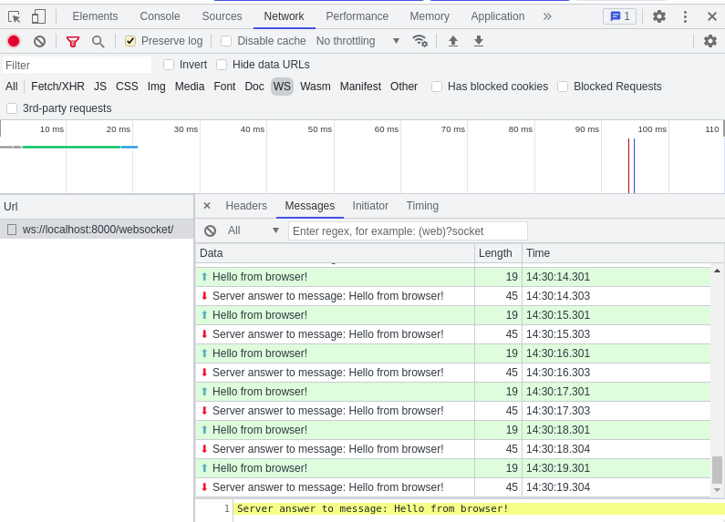

# Django - WebSocker



Best regards https://vk.com/@python_django_ru-veb-sokety-v-django-31

```shell
python3.8 -m pip install uvicorn

uvicorn project.asgi:application --reload --debug

    INFO:     Will watch for changes in these directories: ['/asgi']
    INFO:     Uvicorn running on http://127.0.0.1:8000 (Press CTRL+C to quit)
    INFO:     Started reloader process [20763] using StatReload
    INFO:     Started server process [20765]
    INFO:     Waiting for application startup.
    INFO:     ASGI 'lifespan' protocol appears unsupported.
    INFO:     Application startup complete.

```
